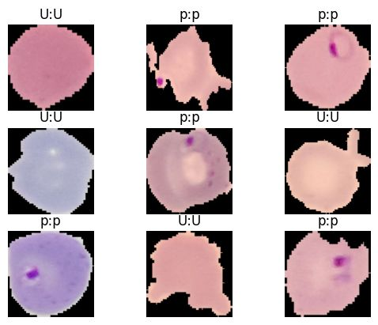

# Malaria Detection using Deep Learning 🦟

## 📄 Project Description
Using **TensorFlow** and **CNNs (Convolutional Neural Networks)**, I developed a malaria detection and prediction model. This tool is designed to assist medical professionals in automating the diagnosis process by detecting whether a blood cell is **Parasitized** or **Uninfected** from thin blood smear images.

## 📂 Dataset
The model was trained on the **NIH Malaria Dataset**, which contains 27,558 images of cells.

## 🧠 Methodology
* **Preprocessing**: Resizing images to 224x224 and normalizing pixel values.
* **Architecture**: Custom CNN with Convolutional, MaxPooling, and Dense layers.
* **Loss Function**: Binary Crossentropy.
* **Optimizer**: Adam.

## 📊 Results & Predictions
Below is a sample of the model's predictions on the test set. 
* **p** = Parasitized
* **U** = Uninfected
* Format: `Actual : Predicted`

*(The image above shows the model correctly identifying parasitized and uninfected cells)*

## 🚀 How to Run
1.  Clone the repository.
2.  Install dependencies: `pip install tensorflow matplotlib tensorflow-datasets`
3.  Run the notebook `Malaria.ipynb`.
